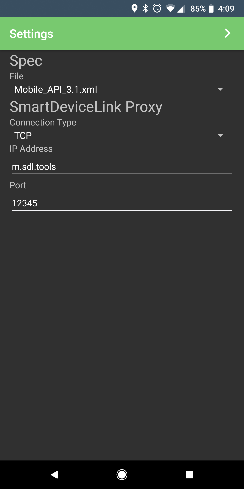
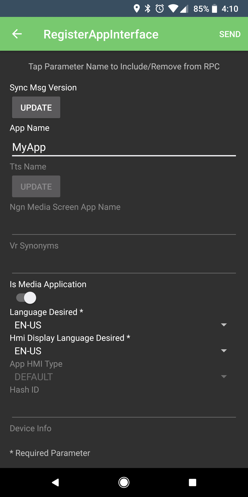
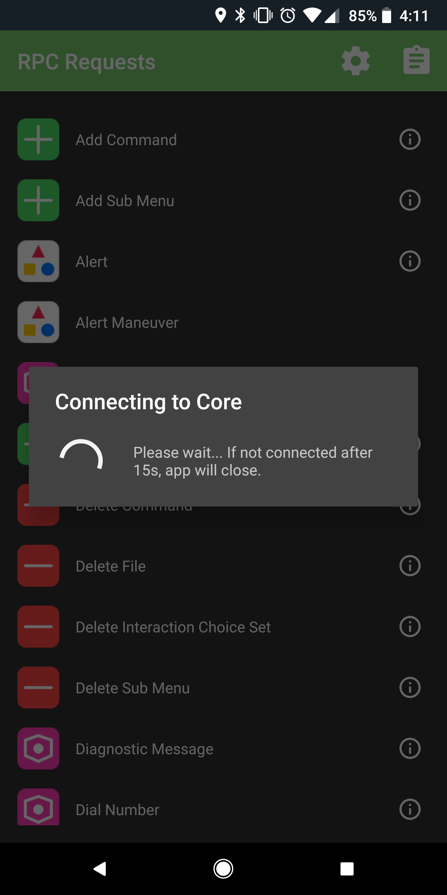
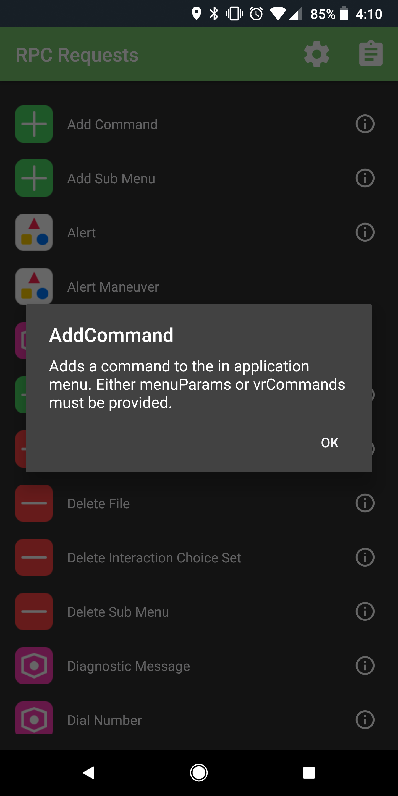
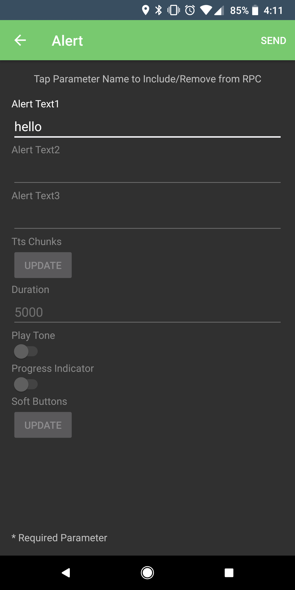

# RPC Builder v1.0.0

## Introduction
The SmartDeviceLink RPC Builder is designed to allow free testing of the SDL Interface during development. It will allow sending all Remote Procedure Calls (RPCs) to SDL Core. The user has to ensure the right sequence of commands to be send. (E.g. a performInteraction cannot be successful if the user did not send a createInteractionChoiceSet before. Please familiarize yourself with the SDL App Developer documentation.)

## Getting Started
In order to begin using RPC Builder, we must first clone this repository. Then all that is needed is to navigate to the apk's directory and install the built apk:
```
cd rpc_builder_app_android/RPCBuilder/app/build
outputs/apk
adb install
```

## Interface

###Settings Page


The settings page allows the user to select the currently used RPC spec file, and the transport layer.

By default, there are two Mobile_API.xml files used to generate the RPC interfaces usable by the app. Please be sure to select this file to proceed.

For the transport layer the current options included BT (Bluetooth) or TCP/IP. If TCP/IP is selected the user has to input the SDL Server IP Address and Port. If using BT, you can disregard these two fields.



Once proceeding, you will be presented with a Register App Interface (RAI) RPC screen. This is required so that when the application first connects we can immediately register the application. These properties can be modified and will be cached for subsequent launches.



__Please note that once "Send" is pressed, the application will not continue until a successful connection and RAI response is received.__

###Main RPC Table


The Main RPC Table is create at runtime by the App. The source for all possible RPC requests is the selected Spec XML from the settings.

If the Spec provides additional information, an information button next to the RPC Name is visible.



To send an RPC select the RPC from the Table

###RPC Commands


When selecting an RPC command the App will show a view with all possible parameters for this RPC command. If a parameter is a struct or array, it will allow you fill this information in a separate view. A struct or array is indicated by an "UPDATE" button.

There are three different ways to send an argument of an RPC.

* Send with data.
 * To send an argument with data just add the information next to the arguments name.
* Send without data
 * To send an argument with an empty string, leave the field next to the argument name empty
* Don't send the argument
 * To disable the argument from being included in the RPC touch the arguments name. The argument will be grayed out and not included in the request. (See example below)



Alert Text1 and Alert Text3 will not be included in the RPC Request, but Alert Text2 will be included with an empty string.
Required data will have asterisks next to the argument name.